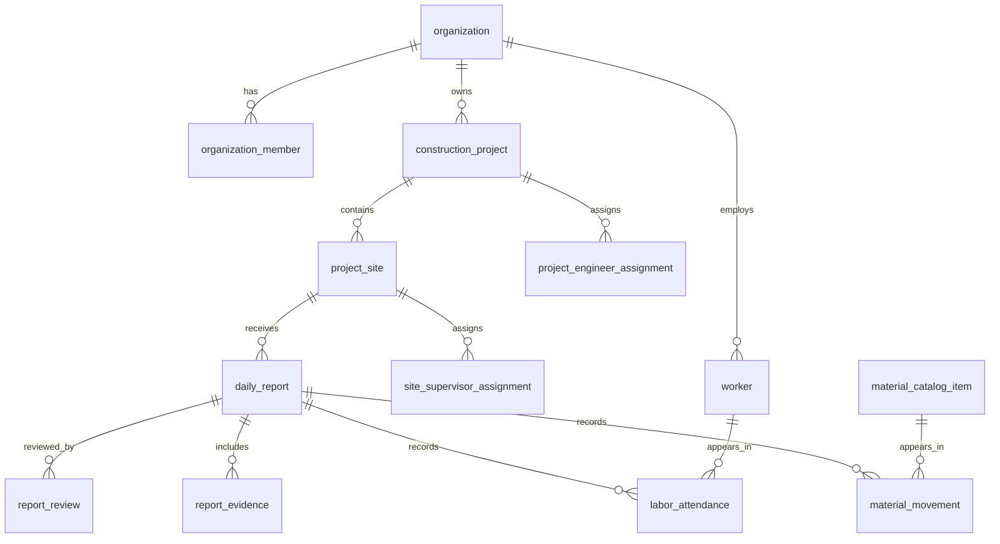

# Data Model

This data model is the first implementation foundation for the government construction management product. It follows the decision from the 2026-05-26 pivot meeting to design the database before writing feature code.

## ERD

## Core Tables

### organization

Represents a tenant: government office or contractor company.

- `id UUID PRIMARY KEY`
- `kind VARCHAR NOT NULL` - `government_office` or `contractor_company`
- `name VARCHAR NOT NULL`
- `registration_identifier VARCHAR NULL`
- `created_at TIMESTAMP WITH TIME ZONE NOT NULL`
- `updated_at TIMESTAMP WITH TIME ZONE NOT NULL`

### organization_member

Links Supabase users to an organization and role.

- `id UUID PRIMARY KEY`
- `organization_id UUID NOT NULL`
- `user_id UUID NOT NULL`
- `role VARCHAR NOT NULL` - `government_engineer`, `contractor_admin`, `site_supervisor`
- `is_active BOOLEAN NOT NULL`
- `created_at TIMESTAMP WITH TIME ZONE NOT NULL`
- `updated_at TIMESTAMP WITH TIME ZONE NOT NULL`

### construction_project

Contract-level public construction project.

- `id UUID PRIMARY KEY`
- `government_organization_id UUID NOT NULL`
- `contractor_organization_id UUID NOT NULL`
- `approved_budget_amount NUMERIC(19,4) NULL`
- `code VARCHAR NOT NULL`
- `description TEXT NULL`
- `ends_at TIMESTAMP WITH TIME ZONE NULL`
- `location_label VARCHAR NOT NULL`
- `name VARCHAR NOT NULL`
- `starts_at TIMESTAMP WITH TIME ZONE NULL`
- `status VARCHAR NOT NULL`
- `created_at TIMESTAMP WITH TIME ZONE NOT NULL`
- `updated_at TIMESTAMP WITH TIME ZONE NOT NULL`

### project_site

Physical construction site under a project.

- `id UUID PRIMARY KEY`
- `construction_project_id UUID NOT NULL`
- `address_text TEXT NULL`
- `latitude NUMERIC(10,7) NULL`
- `longitude NUMERIC(10,7) NULL`
- `name VARCHAR NOT NULL`
- `status VARCHAR NOT NULL`
- `created_at TIMESTAMP WITH TIME ZONE NOT NULL`
- `updated_at TIMESTAMP WITH TIME ZONE NOT NULL`

### project_engineer_assignment

Engineer access to a construction project.

- `id UUID PRIMARY KEY`
- `construction_project_id UUID NOT NULL`
- `organization_member_id UUID NOT NULL`
- `assigned_at TIMESTAMP WITH TIME ZONE NOT NULL`
- `created_at TIMESTAMP WITH TIME ZONE NOT NULL`

### site_supervisor_assignment

Supervisor access to a project site.

- `id UUID PRIMARY KEY`
- `project_site_id UUID NOT NULL`
- `organization_member_id UUID NOT NULL`
- `assigned_at TIMESTAMP WITH TIME ZONE NOT NULL`
- `created_at TIMESTAMP WITH TIME ZONE NOT NULL`

### worker

Contractor worker registry.

- `id UUID PRIMARY KEY`
- `organization_id UUID NOT NULL`
- `full_name VARCHAR NOT NULL`
- `phone_number VARCHAR NULL`
- `trade VARCHAR NULL`
- `is_active BOOLEAN NOT NULL`
- `created_at TIMESTAMP WITH TIME ZONE NOT NULL`
- `updated_at TIMESTAMP WITH TIME ZONE NOT NULL`

### daily_report

One daily submission for a project site.

- `id UUID PRIMARY KEY`
- `project_site_id UUID NOT NULL`
- `submitted_by_organization_member_id UUID NOT NULL`
- `blocker_summary TEXT NULL`
- `progress_percentage NUMERIC(5,2) NULL`
- `report_date DATE NOT NULL`
- `safety_notes TEXT NULL`
- `status VARCHAR NOT NULL` - `draft`, `submitted`, `accepted`, `rejected`, `needs_revision`
- `weather_notes TEXT NULL`
- `work_summary TEXT NOT NULL`
- `created_at TIMESTAMP WITH TIME ZONE NOT NULL`
- `submitted_at TIMESTAMP WITH TIME ZONE NULL`
- `updated_at TIMESTAMP WITH TIME ZONE NOT NULL`

### labor_attendance

Worker attendance captured inside a daily report.

- `id UUID PRIMARY KEY`
- `daily_report_id UUID NOT NULL`
- `worker_id UUID NOT NULL`
- `checked_in_at TIMESTAMP WITH TIME ZONE NULL`
- `checked_out_at TIMESTAMP WITH TIME ZONE NULL`
- `notes TEXT NULL`
- `presence_status VARCHAR NOT NULL` - `present`, `absent`, `partial`
- `created_at TIMESTAMP WITH TIME ZONE NOT NULL`

### material_catalog_item

Reusable material catalog.

- `id UUID PRIMARY KEY`
- `organization_id UUID NOT NULL`
- `default_unit VARCHAR NOT NULL`
- `name VARCHAR NOT NULL`
- `created_at TIMESTAMP WITH TIME ZONE NOT NULL`
- `updated_at TIMESTAMP WITH TIME ZONE NOT NULL`

### material_movement

Material received, consumed, or remaining on a site for a daily report.

- `id UUID PRIMARY KEY`
- `daily_report_id UUID NOT NULL`
- `material_catalog_item_id UUID NOT NULL`
- `movement_type VARCHAR NOT NULL` - `received`, `consumed`, `remaining`
- `quantity NUMERIC(19,4) NOT NULL`
- `unit VARCHAR NOT NULL`
- `notes TEXT NULL`
- `created_at TIMESTAMP WITH TIME ZONE NOT NULL`

### report_evidence

Photo or document evidence attached to a report.

- `id UUID PRIMARY KEY`
- `daily_report_id UUID NOT NULL`
- `uploaded_by_organization_member_id UUID NOT NULL`
- `caption TEXT NULL`
- `captured_at TIMESTAMP WITH TIME ZONE NULL`
- `file_mime_type VARCHAR NOT NULL`
- `file_name VARCHAR NOT NULL`
- `file_size_bytes BIGINT NOT NULL`
- `storage_path TEXT NOT NULL`
- `created_at TIMESTAMP WITH TIME ZONE NOT NULL`

### report_review

Engineer review decision for a submitted report.

- `id UUID PRIMARY KEY`
- `daily_report_id UUID NOT NULL`
- `reviewed_by_organization_member_id UUID NOT NULL`
- `comments TEXT NULL`
- `decision VARCHAR NOT NULL` - `accepted`, `rejected`, `needs_revision`
- `created_at TIMESTAMP WITH TIME ZONE NOT NULL`

## Key Constraints

- `organization_member` has `UNIQUE (organization_id, user_id)`.
- `construction_project` has `UNIQUE (government_organization_id, code)`.
- `project_engineer_assignment` has `UNIQUE (construction_project_id, organization_member_id)`.
- `site_supervisor_assignment` has `UNIQUE (project_site_id, organization_member_id)`.
- `daily_report` has `UNIQUE (project_site_id, report_date)`.
- `labor_attendance` has `UNIQUE (daily_report_id, worker_id)`.

## RLS Strategy

- Organization members can read their own membership.
- Government engineers can read projects owned by their government organization or assigned to them.
- Contractor members can read projects linked to their contractor organization.
- Site supervisors can create and update draft reports only for assigned sites.
- Engineers assigned to a project can review submitted reports.
- Evidence access follows the parent daily report.

## Open Questions

- Should worker identities be global across contractors or scoped to one contractor organization only?
- Does every project need exactly one contractor, or can joint ventures exist?
- Does a daily report require engineer approval before becoming part of official progress history?
- What offline support is required for rural sites?
